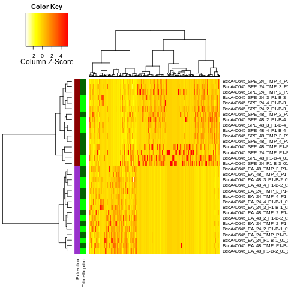

# motifHeat 

Wrapper to format heamap from defined [GNPS-MZmine](https://gnps.ucsd.edu/) inputs

### Table of contents

* [Installation](#installation)
* [Run motifHeat](#run_motifHeat)
* [License](#license)

## Installation 

Install motifHeat with:

 `devtools::install_github("computational-chemical-biology/motifHeat")`

## Run motifHeat 

To run `motifHeat` simply do:

```
# Load data from GNPS
dlist <- access_gnps('fe23366fb6e34bee84ac9c1d2c17f5ba',            
                      '7d7e7ed46a954dcbbf3b537e05c9792f')
tab <- dlist$features
meta <- dlist$metadata

# Define coloring scheme
factorColList <- list(list(colors=c("darkorchid","darkred"), factor='Extraction'), 
                      list(colors=c("green", "darkgreen"), factor='Trimethoprim'))

# Plot heatmap
h <- format_heatmap(tab, meta, selectField='StrainName', selectValue='Burkholderia dolosa AU0645  Genomovar type VI', 
                    factorColList=factorColList)
```

You should be able to generate the following image



## License
This repository is available under the following [license](https://github.com/computational-chemical-biology/motifHeat/blob/master/LICENSE).
