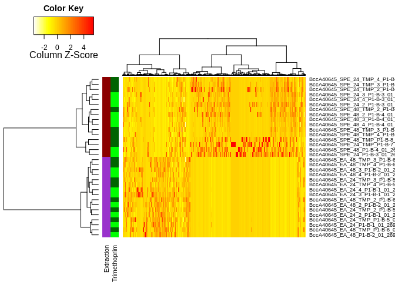
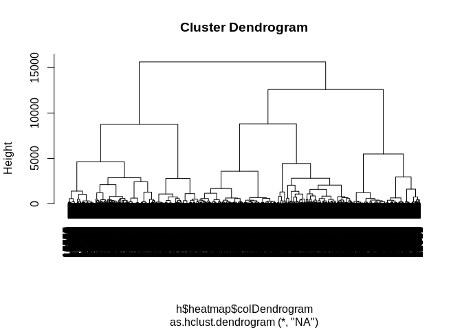
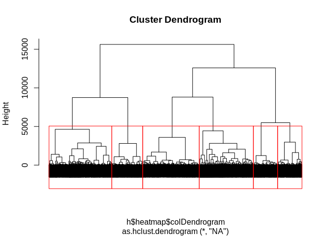
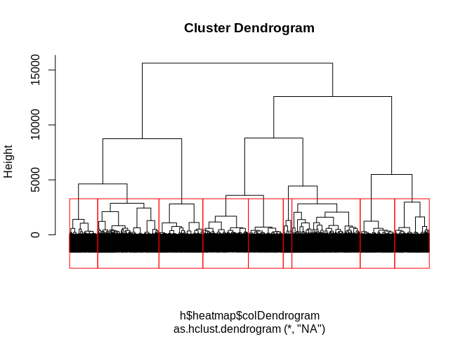
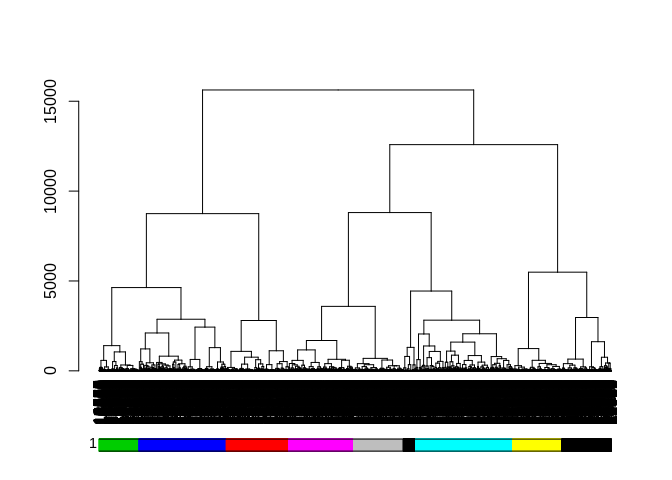

motif\_heatmap
================

motifHeat
---------

This is a short tutorial to introduce motifHeat, associating hierarchical clustering to motif detection.

First we need to install the dependencies

``` r
packageList <- c("devtools", "dendextend")
newPackages <- packageList[!(packageList %in% installed.packages()[,"Package"])]
if(length(newPackages)) install.packages(newPackages)

library("devtools")
library("dendextend")
```

    ## 
    ## ---------------------
    ## Welcome to dendextend version 1.12.0
    ## Type citation('dendextend') for how to cite the package.
    ## 
    ## Type browseVignettes(package = 'dendextend') for the package vignette.
    ## The github page is: https://github.com/talgalili/dendextend/
    ## 
    ## Suggestions and bug-reports can be submitted at: https://github.com/talgalili/dendextend/issues
    ## Or contact: <tal.galili@gmail.com>
    ## 
    ##  To suppress this message use:  suppressPackageStartupMessages(library(dendextend))
    ## ---------------------

    ## 
    ## Attaching package: 'dendextend'

    ## The following object is masked from 'package:stats':
    ## 
    ##     cutree

``` r
if (!require("motifHeat")) {
    install_github("computational-chemical-biology/motifHeat")
} else {
    library("motifHeat")
}
```

    ## Loading required package: motifHeat

Load data from GNPS
-------------------

You need your GNPS task id and optionally ms2lda:

``` r
dlist <- access_gnps('fe23366fb6e34bee84ac9c1d2c17f5ba',            '7d7e7ed46a954dcbbf3b537e05c9792f')
```

    ## Downloading MZmine feature table...
    ## Downloading metadata table...
    ## Downloading ms2lda nodes table...
    ## Downloading ms2lda motifs table...
    ## Downloading ms2lda edges table...

Recover most frequent motifs
----------------------------

Display motifs annotated:

``` r
head(dlist$motifs_in_scans)
```

    ##    scan precursor.mass retention.time             motif probability
    ## 1  4446       210.0795              0         motif_430   0.1464223
    ## 2  4446       210.0795              0         motif_275   0.1195613
    ## 3  4446       210.0795              0         motif_283   0.5643234
    ## 4 11542       334.0891              0    mb_motif_4.m2m   0.3174744
    ## 5 11546       355.2611              0 gnps_motif_50.m2m   0.2163649
    ## 6 11547       334.0891              0    mb_motif_4.m2m   0.2779048
    ##     overlap                            motifdb_url
    ## 1 0.6326198                                       
    ## 2 0.3065079                                       
    ## 3 0.3872404                                       
    ## 4 0.7720745 http://ms2lda.org/motifdb/motif/151183
    ## 5 0.3813208 http://ms2lda.org/motifdb/motif/151059
    ## 6 0.7720116 http://ms2lda.org/motifdb/motif/151183
    ##                                                                                                                        motifdb_annotation
    ## 1                                                                                                                                        
    ## 2                                                                                                                                        
    ## 3                                                                                                                                        
    ## 4 Loss of methyl group – indicative for presence of methoxy [O-CH3] methylsulfyl [S-CH3] or methylgroup connected to aromatic ring system
    ## 5                               Steroid core related (C18H21 and smaller fragments thereof - with C12H13 C11H11 and C11H13 most probable)
    ## 6 Loss of methyl group – indicative for presence of methoxy [O-CH3] methylsulfyl [S-CH3] or methylgroup connected to aromatic ring system

Count the motifs and display the most frequent

``` r
motif_count <- table(dlist$motifs_in_scans[,'motif'])
motif_count[order(motif_count, decreasing=TRUE)][1:5]
```

    ## 
    ##         motif_445         motif_279  gnps_motif_7.m2m gnps_motif_59.m2m 
    ##               515               402               394               387 
    ##         motif_414 
    ##               323

Select cluster indexes associated to most frequent

``` r
smotif <- dlist$motifs_in_scans[dlist$motifs_in_scans[,'motif'] %in% c('motif_445'), c('scan', 'motif')]
head(smotif)
```

    ##      scan     motif
    ## 15   6797 motif_445
    ## 62   9250 motif_445
    ## 71   3519 motif_445
    ## 107 13052 motif_445
    ## 115 17828 motif_445
    ## 166  4592 motif_445

Format color for sample classes
-------------------------------

factorCorLis is a nested list with one color for each level of a factor:

``` r
factorColList <- list(list(colors=c("darkorchid","darkred"), factor='Extraction'), list(colors=c("green", "darkgreen"), factor='Trimethoprim'))
```

Plot a basic heatmap
--------------------

You can also embed plots, for example:

``` r
tab <- dlist$features
meta <- dlist$metadata
h <- format_heatmap(tab, meta, selectField='StrainName', selectValue='Burkholderia dolosa AU0645  Genomovar type VI', factorColList=factorColList)
```

 We can also add motif labels to the features in the heatmap:

``` r
h <- format_heatmap(tab, meta, selectField='StrainName', labCol=smotif, selectValue='Burkholderia dolosa AU0645  Genomovar type VI', factorColList=factorColList)
```


Recover data from heatmap's hierarchical clustering
---------------------------------------------------

The heatmap result contains hierarchical clustering from samples and features. We can associate the sample grouping to colors

``` r
# needs preprocessing
head(cbind(t(h$colors), colnames(tab)[grep('Peak area', colnames(tab))])[h$heatmap$rowInd,])
```

    ## Warning in cbind(t(h$colors), colnames(tab)[grep("Peak area",
    ## colnames(tab))]): number of rows of result is not a multiple of vector
    ## length (arg 2)

    ##    Extraction   Trimethoprim
    ## EA "darkorchid" "green"     
    ## EA "darkorchid" "darkgreen" 
    ## EA "darkorchid" "green"     
    ## EA "darkorchid" "darkgreen" 
    ## EA "darkorchid" "green"     
    ## EA "darkorchid" "darkgreen" 
    ##                                                        
    ## EA "TestMix1_P1-F-2_01_2636.mzXML Peak area"           
    ## EA "BurkC5424_EA_48_TMP_P1-C-6_01_2745.mzXML Peak area"
    ## EA "TestMix18_P1-F-2_01_2856.mzXML Peak area"          
    ## EA "Bdolosa_EA_48_TMP_P1-C-6_01_2666.mzXML Peak area"  
    ## EA "TestMix5_P1-F-2_01_2682.mzXML Peak area"           
    ## EA "BcK562_SPE_24_3_P1-E-3_01_2808.mzXML Peak area"

Create hclut object from dendrogram and plot the cluters with arbitrary number of groups

``` r
hc <- as.hclust(h$heatmap$colDendrogram)
plot(hc)
```



``` r
plot(hc, labels=FALSE)
rect.hclust(hc, 6)
```



Change the criteria to hight and record grouping

``` r
plot(hc, labels=FALSE)
rect.hclust(hc, h=3000)
```



``` r
hcgrp <- cutree(hc, h=3000)
```

Use grouping to create colored bars

``` r
dend <- h$heatmap$colDendrogram
dend %>% plot 
colored_bars(colors = hcgrp, dend = dend) 
```



Associate hierachical clustering to network component and motif frequency
-------------------------------------------------------------------------

Create a table with all component indexes and associated cluster ids:

``` r
ms2lda <- cbind(c(dlist$ms2lda_edges[, 'CLUSTERID1'], dlist$ms2lda_edges[, 'CLUSTERID2']), rep(dlist$ms2lda_edges[, 'ComponentIndex'], 2))
ms2lda <- unique(ms2lda)
colnames(ms2lda) <- c('CLUSTERID','ComponentIndex')
ms2lda <- ms2lda[ms2lda[,2]!=-1,]
head(ms2lda)
```

    ##      CLUSTERID ComponentIndex
    ## [1,]      3471              1
    ## [2,]     13994              1
    ## [3,]      8343              1
    ## [4,]     15752              1
    ## [5,]     17694              1
    ## [6,]     17693              1

Merge component index and moftif tables

``` r
ms2lda <- merge(ms2lda, dlist$ms2lda_nodes[,c('scans', 'motif')], by.x='CLUSTERID', by.y='scans')
tgrp <- data.frame(CLUSTERID=as.numeric(names(hcgrp)), HCA_GRP=hcgrp) 
ms2lda <- merge(ms2lda, tgrp, by.x='CLUSTERID', by.y='CLUSTERID')
head(ms2lda)
```

    ##   CLUSTERID ComponentIndex               motif HCA_GRP
    ## 1         1            116           motif_391       1
    ## 2         3             55 motif_430,motif_483       1
    ## 3         4             50 motif_430,motif_483       1
    ## 4         5             50 motif_430,motif_483       1
    ## 5         6             50 motif_430,motif_483       1
    ## 6         7            392 motif_430,motif_275       1

Obtain the proportion of nodes from each connected component that are associated to the same group detectep by hierarchical clustering

``` r
comp2grp <- tapply(ms2lda[,4], ms2lda[,2], function(x) c(names(table(x))[which.max(table(x))], max(table(x))/length(x), length(x)))

tcomp2grp <- do.call(rbind, comp2grp)
tcomp2grp <- cbind(names(comp2grp), tcomp2grp)
colnames(tcomp2grp) <- c('ComponentIndex', 'HCA_GRP', 'Max_Proportion', 'Total_Nodes')
tcomp2grp <- tcomp2grp[order(as.numeric(tcomp2grp[,4]), decreasing=TRUE),]
mfmotif <- tapply(ms2lda[,3], ms2lda[,2], function(x) names(which.max(table(unlist(sapply(x, strsplit, ',')))))) 
mfmotif[unlist(lapply(mfmotif, is.null))] <- '' 
tcomp2grp <- cbind(tcomp2grp, '') 
colnames(tcomp2grp)[5] <- 'Most_Freq_Motif' 
tcomp2grp[,5] <- unlist(mfmotif[tcomp2grp[,1]]) 
ulinks <- unique(dlist$motifs_in_scans[,c('motif', 'motifdb_url')]) 
ulinks <- as.matrix(ulinks) 
tcomp2grp <- cbind(tcomp2grp, '')
ids <- match(tcomp2grp[,5], ulinks[,1])
tcomp2grp[!is.na(ids), 6] <- ulinks[ids[!is.na(ids)],2]
head(tcomp2grp)
```

    ##     ComponentIndex HCA_GRP Max_Proportion      Total_Nodes
    ## 228 "228"          "5"     "0.241379310344828" "87"       
    ## 77  "77"           "7"     "0.291139240506329" "79"       
    ## 51  "51"           "7"     "0.358208955223881" "67"       
    ## 137 "137"          "4"     "1"                 "59"       
    ## 93  "93"           "5"     "0.310344827586207" "58"       
    ## 116 "116"          "2"     "0.358490566037736" "53"       
    ##     Most_Freq_Motif                                            
    ## 228 "motif_279"        ""                                      
    ## 77  "motif_374"        ""                                      
    ## 51  "motif_569"        ""                                      
    ## 137 "motif_505"        ""                                      
    ## 93  "gnps_motif_4.m2m" "http://ms2lda.org/motifdb/motif/151030"
    ## 116 "motif_391"        ""
