motif\_heatmap
================

## motifHeat

This is a short tutorial to introduce motifHeat, associating
hierarchical clustering to motif detection.

First we need to install the dependencies

``` r
packageList <- c("devtools", "dendextend")
newPackages <- packageList[!(packageList %in% installed.packages()[,"Package"])]
if(length(newPackages)) install.packages(newPackages)

library("devtools")
library("dendextend")
```

    ## 
    ## ---------------------
    ## Welcome to dendextend version 1.12.0
    ## Type citation('dendextend') for how to cite the package.
    ## 
    ## Type browseVignettes(package = 'dendextend') for the package vignette.
    ## The github page is: https://github.com/talgalili/dendextend/
    ## 
    ## Suggestions and bug-reports can be submitted at: https://github.com/talgalili/dendextend/issues
    ## Or contact: <tal.galili@gmail.com>
    ## 
    ##  To suppress this message use:  suppressPackageStartupMessages(library(dendextend))
    ## ---------------------

    ## 
    ## Attaching package: 'dendextend'

    ## The following object is masked from 'package:stats':
    ## 
    ##     cutree

``` r
if (!require("motifHeat")) {
    install_github("computational-chemical-biology/motifHeat")
} else {
    library("motifHeat")
}
```

    ## Loading required package: motifHeat

## Load data from GNPS

You need your GNPS task id and optionally
ms2lda:

``` r
dlist <- access_gnps('60e8f7096e994d5c9717d471445f8bfe',            '56f089a1772340a0aa2978d41478e3e4')
```

    ## Downloading MZmine feature table...
    ## Downloading metadata table...
    ## Downloading ms2lda nodes table...
    ## Downloading ms2lda motifs table...
    ## Downloading ms2lda edges table...

## Recover most frequent motifs

Display motifs
    annotated:

``` r
head(dlist$motifs_in_scans)
```

    ##   scan precursor.mass retention.time                   motif probability
    ## 1  593       670.4670              0 euphorbia_motif_158.m2m   0.1237446
    ## 2 1200       548.3069              0               motif_333   0.4879933
    ## 3 1200       548.3069              0               motif_374   0.1437222
    ## 4 4024       586.9921              0               motif_521   0.8134345
    ## 5 4025       599.0103              0               motif_521   0.1510719
    ## 6 4020       341.3160              0       gnps_motif_43.m2m   0.2011264
    ##     overlap                            motifdb_url
    ## 1 0.9915291 http://ms2lda.org/motifdb/motif/151115
    ## 2 0.3328333                                       
    ## 3 0.8781329                                       
    ## 4 0.7017773                                       
    ## 5 0.5447280                                       
    ## 6 0.9999885 http://ms2lda.org/motifdb/motif/151021
    ##                                                                             motifdb_annotation
    ## 1                                                                   Loss of NH3 adducts in DSF
    ## 2                                                                                             
    ## 3                                                                                             
    ## 4                                                                                             
    ## 5                                                                                             
    ## 6 Water loss - indicative of a free hydroxyl group – (in beer often seen in sugary structures)

Count the motifs and display the most frequent

``` r
motif_count <- table(dlist$motifs_in_scans[,'motif'])
motif_count[order(motif_count, decreasing=TRUE)][1:5]
```

    ## 
    ##        motif_480 gnps_motif_7.m2m        motif_295 gnps_motif_4.m2m 
    ##              330              273              258              200 
    ##        motif_337 
    ##              149

Select cluster indexes associated to most
frequent

``` r
smotif <- dlist$motifs_in_scans[dlist$motifs_in_scans[,'motif'] %in% c('motif_480'), c('scan', 'motif')]
head(smotif)
```

    ##     scan     motif
    ## 92  2442 motif_480
    ## 97  2446 motif_480
    ## 106 2449 motif_480
    ## 163 3389 motif_480
    ## 202 1199 motif_480
    ## 206 1191 motif_480

## Format color for sample classes

factorCorLis is a nested list with one color for each level of a
factor:

``` r
factorColList <- list(list(colors=c("darkorchid","darkred"), factor='Extraction'), list(colors=c("green", "darkgreen"), factor='Trimethoprim'))
```

## Plot a basic heatmap

You can also embed plots, for example:

``` r
tab <- dlist$features
meta <- dlist$metadata
h <- format_heatmap(tab, meta, selectField='StrainName', selectValue='Burkholderia dolosa AU0645  Genomovar type VI', factorColList=factorColList)
```

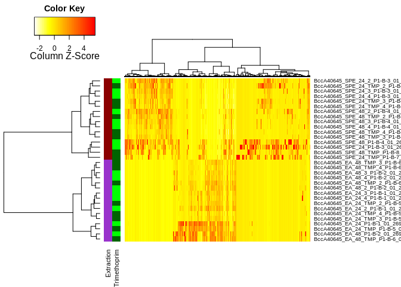<!-- --> We can
also add motif labels to the features in the
heatmap:

``` r
h <- format_heatmap(tab, meta, selectField='StrainName', labCol=smotif, selectValue='Burkholderia dolosa AU0645  Genomovar type VI', factorColList=factorColList)
```

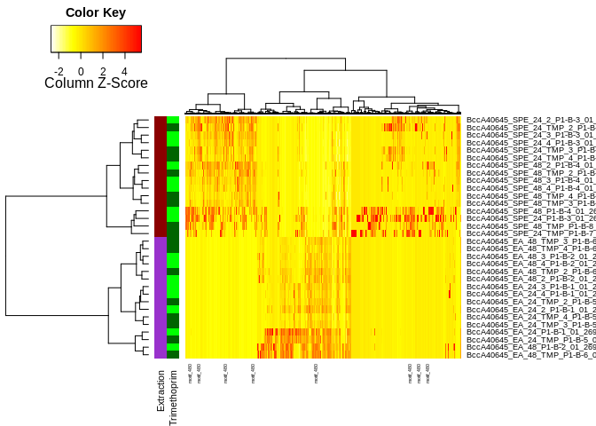<!-- -->
Subselect metadata and repeat
heatmap:

``` r
meta2 <- meta[meta$TimePoint=='48h' & grepl('EA', meta$Extraction) & grepl('Burkholderia', meta$StrainName),]
factorColList <- list(list(colors=rainbow(length(unique(meta2$StrainName))), factor='StrainName'))
h <- format_heatmap(tab, meta2, labCol=smotif, factorColList=factorColList)
```

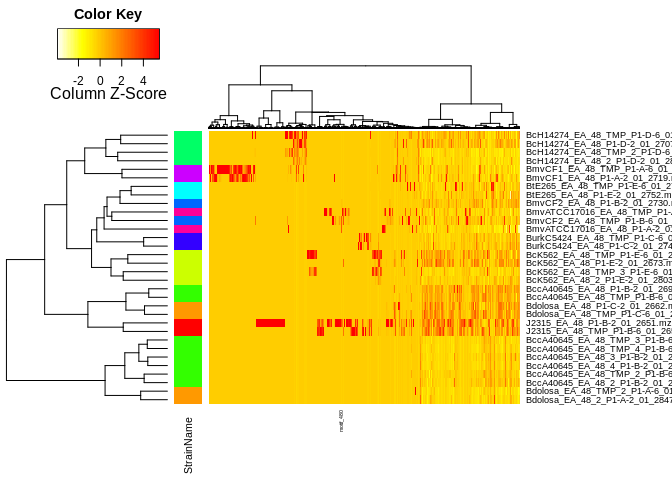<!-- -->
Changing color scale:

``` r
library("gplots")
```

    ## 
    ## Attaching package: 'gplots'

    ## The following object is masked from 'package:stats':
    ## 
    ##     lowess

``` r
h <- format_heatmap(tab, meta2, labCol=smotif, factorColList=factorColList, colorScale = redgreen(75))
```

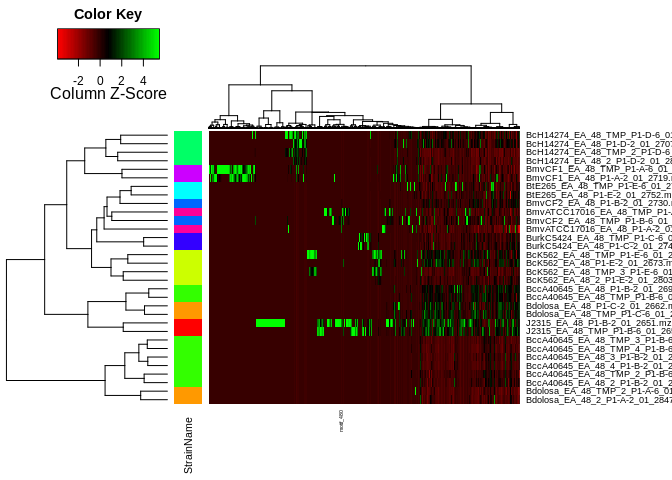<!-- -->
Adding
normalization:

``` r
h <- format_heatmap(tab, meta2, labCol=smotif, norm=TRUE, factorColList=factorColList, colorScale = redgreen(75))
```

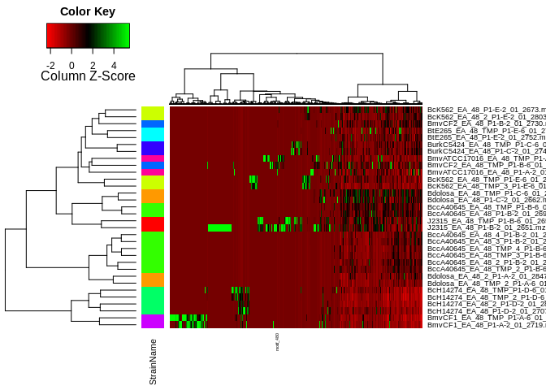<!-- -->
Creating a pdf:

    ## png 
    ##   2

Repeating the process for other condition:

    ## png 
    ##   2

## Recover data from heatmap’s hierarchical clustering

The heatmap result contains hierarchical clustering from samples and
features. We can associate the sample grouping to colors

``` r
# needs preprocessing
head(cbind(t(h$colors), colnames(tab)[grep('Peak area', colnames(tab))])[h$heatmap$rowInd,])
```

    ## Warning in cbind(t(h$colors), colnames(tab)[grep("Peak area",
    ## colnames(tab))]): number of rows of result is not a multiple of vector
    ## length (arg 2)

    ##                                 StrainName 
    ## Burkholderia thailandensis E264 "#CC00FFFF"
    ## Burkholderia thailandensis E264 "#CC00FFFF"
    ## Burkholderia cenocepacia MC0-3  "#00FF66FF"
    ## Burkholderia cenocepacia MC0-3  "#00FF66FF"
    ## Burkholderia cenocepacia MC0-3  "#00FF66FF"
    ## Burkholderia cenocepacia MC0-3  "#00FF66FF"
    ##                                                                                                
    ## Burkholderia thailandensis E264 "TestMix18_P1-F-2_01_2856.mzXML filtered Peak area"            
    ## Burkholderia thailandensis E264 "TestMix7_P1-F-2_01_2704.mzXML filtered Peak area"             
    ## Burkholderia cenocepacia MC0-3  "BccA40645_EA_24_4_P1-B-1_01_2835.mzXML filtered Peak area"    
    ## Burkholderia cenocepacia MC0-3  "BmvCF2_EA_24_TMP_P1-B-5_01_2733.mzXML filtered Peak area"     
    ## Burkholderia cenocepacia MC0-3  "BtE265_EA_48_TMP_P1-E-6_01_2756.mzXML filtered Peak area"     
    ## Burkholderia cenocepacia MC0-3  "BccA40645_EA_24_TMP_2_P1-B-5_01_2776.mzXML filtered Peak area"

Create hclut object from dendrogram and plot the cluters with arbitrary
number of groups

``` r
hc <- as.hclust(h2$heatmap$colDendrogram)
plot(hc)
```

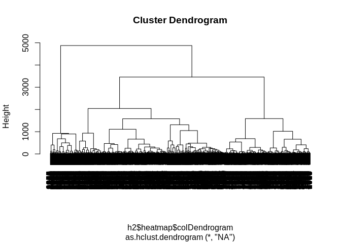<!-- -->

``` r
plot(hc, labels=FALSE)
rect.hclust(hc, 6)
```

<!-- -->

Change the criteria to hight and record grouping

``` r
plot(hc, labels=FALSE)
rect.hclust(hc, h=1500)
```

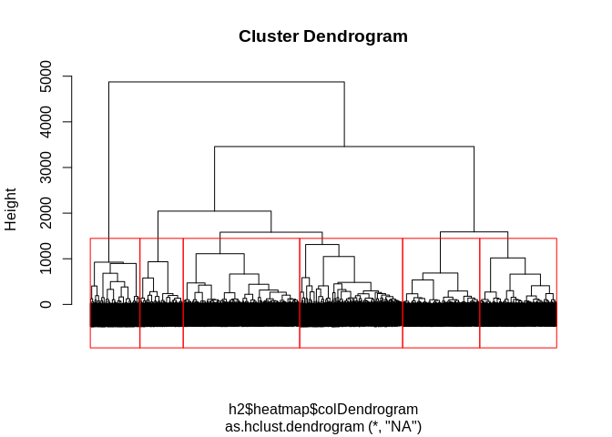<!-- -->

``` r
hcgrp <- cutree(hc, h=1500)
```

Use grouping to create colored bars

``` r
dend <- h2$heatmap$colDendrogram
dend %>% plot 
colored_bars(colors = hcgrp, dend = dend) 
```

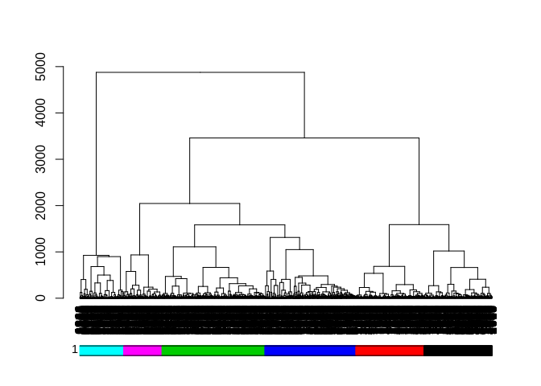<!-- -->

## Associate hierachical clustering to network component and motif frequency

Create a table with all component indexes and associated cluster
ids:

``` r
ms2lda <- cbind(c(dlist$ms2lda_edges[, 'CLUSTERID1'], dlist$ms2lda_edges[, 'CLUSTERID2']), rep(dlist$ms2lda_edges[, 'ComponentIndex'], 2))
ms2lda <- unique(ms2lda)
colnames(ms2lda) <- c('CLUSTERID','ComponentIndex')
ms2lda <- ms2lda[ms2lda[,2]!=-1,]
head(ms2lda)
```

    ##      CLUSTERID ComponentIndex
    ## [1,]       725              1
    ## [2,]      3461              2
    ## [3,]      1670              2
    ## [4,]      3718              2
    ## [5,]      1897              2
    ## [6,]      1141              2

Merge component index and moftif
tables

``` r
ms2lda <- merge(ms2lda, dlist$ms2lda_nodes[,c('scans', 'motif')], by.x='CLUSTERID', by.y='scans')
tgrp <- data.frame(CLUSTERID=as.numeric(names(hcgrp)), HCA_GRP=hcgrp) 
ms2lda <- merge(ms2lda, tgrp, by.x='CLUSTERID', by.y='CLUSTERID')
head(ms2lda)
```

    ##   CLUSTERID ComponentIndex                       motif HCA_GRP
    ## 1         1            387                   motif_451       1
    ## 2         2            387                   motif_451       1
    ## 3         3            387                   motif_451       2
    ## 4         5            982                                   1
    ## 5         6              7                                   2
    ## 6         7            167 gnps_motif_43.m2m,motif_451       1

Obtain the proportion of nodes from each connected component that are
associated to the same group detectep by hierarchical
clustering

``` r
comp2grp <- tapply(ms2lda[,4], ms2lda[,2], function(x) c(names(table(x))[which.max(table(x))], max(table(x))/length(x), length(x)))

tcomp2grp <- do.call(rbind, comp2grp)
tcomp2grp <- cbind(names(comp2grp), tcomp2grp)
colnames(tcomp2grp) <- c('ComponentIndex', 'HCA_GRP', 'Max_Proportion', 'Total_Nodes')
tcomp2grp <- tcomp2grp[order(as.numeric(tcomp2grp[,4]), decreasing=TRUE),]
mfmotif <- tapply(ms2lda[,3], ms2lda[,2], function(x) names(which.max(table(unlist(sapply(x, strsplit, ',')))))) 
mfmotif[unlist(lapply(mfmotif, is.null))] <- '' 
tcomp2grp <- cbind(tcomp2grp, '') 
colnames(tcomp2grp)[5] <- 'Most_Freq_Motif' 
tcomp2grp[,5] <- unlist(mfmotif[tcomp2grp[,1]]) 
ulinks <- unique(dlist$motifs_in_scans[,c('motif', 'motifdb_url')]) 
ulinks <- as.matrix(ulinks) 
tcomp2grp <- cbind(tcomp2grp, '')
ids <- match(tcomp2grp[,5], ulinks[,1])
tcomp2grp[!is.na(ids), 6] <- ulinks[ids[!is.na(ids)],2]
head(tcomp2grp)
```

    ##     ComponentIndex HCA_GRP Max_Proportion      Total_Nodes Most_Freq_Motif
    ## 2   "2"            "3"     "0.519607843137255" "102"       "motif_295"    
    ## 7   "7"            "4"     "0.3625"            "80"        "motif_391"    
    ## 60  "60"           "2"     "0.513157894736842" "76"        "motif_486"    
    ## 12  "12"           "1"     "0.4"               "70"        "motif_295"    
    ## 51  "51"           "6"     "0.883720930232558" "43"        "motif_477"    
    ## 297 "297"          "1"     "0.395348837209302" "43"        "motif_448"    
    ##       
    ## 2   ""
    ## 7   ""
    ## 60  ""
    ## 12  ""
    ## 51  ""
    ## 297 ""

Save table

``` r
colnames(tcomp2grp)[6] <- 'Link'
write.table(tcomp2grp, 'component_group_association.tsv', sep='\t', row.names=FALSE)
```

In order to localize interesting features in the dendrogram we can need
first to select the interesting branches. Here we use the reources of
the source function
`format_heatmap`.

``` r
meta2 <- meta[meta$TimePoint=='48h' & grepl('EA', meta$Extraction) & grepl('Burkholderia', meta$StrainName),]
meta2 <- meta2[grep('cenocepacia', meta2$StrainName),]
factorColList <- list(list(colors=rainbow(length(unique(meta2$StrainName))), factor='StrainName'))
pdf('EA_48h_Cenocepacia_strains.pdf')
h <- format_heatmap(tab, meta2, labCol=smotif, factorColList=factorColList, norm=TRUE, colorScale = redgreen(75))
dev.off()
```

    ## png 
    ##   2

``` r
exc <- c('BcH14274_EA_48_2_P1-D-2_01_2859.mzXML',  'BcH14274_EA_48_TMP_2_P1-D-6_01_2865.mzXML', 
         'BcK562_EA_48_2_P1-E-2_01_2803.mzXML', 'BcK562_EA_48_TMP_3_P1-E-6_01_2811.mzXML')

h <- format_heatmap(tab, meta2[!meta2[,1]%in% exc,], labCol=smotif, factorColList=factorColList, norm=TRUE, colorScale = redgreen(75))
```

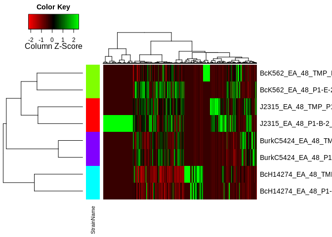<!-- -->

``` r
cdend <- h$heatmap$colDendrogram

colbranches <- function(n, col) {
  a <- attributes(n) # Find the attributes of current node
  # Color edges with requested color
  attr(n, "edgePar") <- c(a$edgePar, list(col=col, lwd=2))
  n # Don't forget to return the node!
}
cdend[[2]][[2]][[2]][[2]][[1]] = dendrapply(cdend[[2]][[2]][[2]][[2]][[1]], colbranches, "blue")
cdend[[1]] = dendrapply(cdend[[1]], colbranches, "red")
plot(cdend)
```

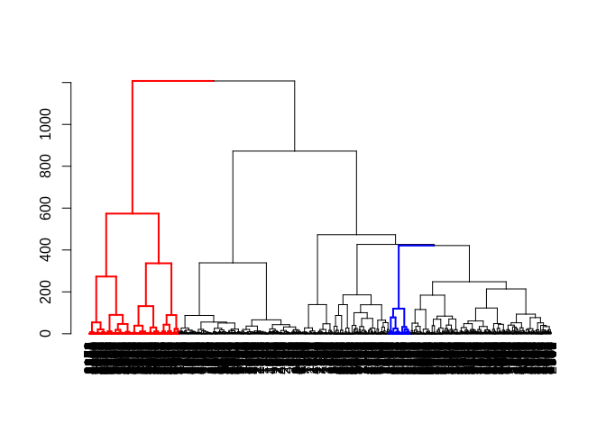<!-- -->

``` r
featureTable=tab; metadataTable=meta2[!meta2[,1]%in% exc,]; labCol=smotif; factorColList=factorColList; norm=TRUE; colorScale = redgreen(75)
tab2 <- featureTable[, grep('Peak area', colnames(featureTable))]
tab2 <- t(tab2)
rownames(tab2) <- sub(' filtered Peak area$| Peak area$', '', rownames(tab2))
colnames(tab2) <- tab[,'row ID']
# order samples according to metadata
tab2 <- tab2[metadataTable[,1],]
tab2 <- tab2[,apply(tab2, 2, sum)!=0]
if (norm) {
  tab2 <- t(apply(tab2, 1, function(x) x/sum(x)))
}
if (length(labCol)) {
  tmp <- rep('', ncol(tab2))
  mt <- match(labCol[,1], colnames(tab2))
  if(any(is.na(mt))) {
  labCol <- labCol[!is.na(mt),]
  mt <- mt[!is.na(mt)]
  }
  tmp[mt] <- labCol[,2]
  labCol <- tmp
} else {
  labCol <- rep('', ncol(tab2))
}
colList <- list()
if (length(factorColList)) {
  fnames <- c()
  for(i in 1:length(factorColList)) {
    colList[[i]] <- factorColList[[i]]$colors
    names(colList[[i]]) <- unique(metadataTable[, factorColList[[i]]$factor])
    colList[[i]] <- colList[[i]][metadataTable[, factorColList[[i]]$factor]]
    fnames <- append(fnames, factorColList[[i]]$factor)
  }
  rlab <- do.call(rbind, colList)
  rownames(rlab) <- fnames
}
mydist <- function(c) { dist(c, method="canberra") }
myclust <- function(c) { hclust(c, method="ward.D") }

# Load source code
source('../R/heatmap.3.R')

#pdf('EA_48h_Cenocepacia_selected_strains.pdf')
h <- heatmap.3(tab2, hclustfun=myclust, distfun=mydist, na.rm = TRUE, scale="column", dendrogram="both", margins=c(6,12),
  Rowv=TRUE, Colv=cdend,  RowSideColors=rlab, symbreaks=FALSE, key=TRUE, symkey=FALSE,
  density.info="none", trace="none", labCol=labCol, labRow=rownames(tab2), col=colorScale,
  ColSideColorsSize=7, RowSideColorsSize=2, KeyValueName="Ion intensity")
```

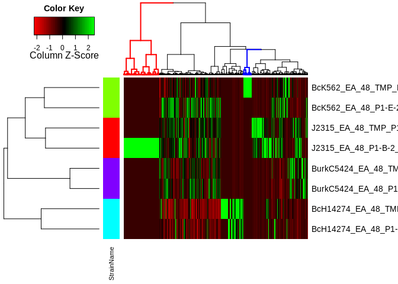<!-- -->

``` r
#dev.off()
```

After the selection, we can select the features included in the groups
of interest and export
them.

``` r
url_to_attributes = paste0("http://gnps.ucsd.edu/ProteoSAFe/DownloadResultFile?task=", '60e8f7096e994d5c9717d471445f8bfe', "&block=main&file=clusterinfo_summary/")
gnps <- read.delim(url_to_attributes)

reddend <- gnps[gnps[,"cluster.index"] %in% labels(cdend[[1]]),]
reddend <- reddend[,c("cluster.index", "componentindex", "parent.mass", "RTMean", "LibraryID")]
reddend <- merge(reddend, dlist$ms2lda_nodes[,1:7], by.x='cluster.index', by.y='scans')
head(reddend)
```

    ##   cluster.index componentindex parent.mass RTMean
    ## 1            68             -1    643.1361 5.6006
    ## 2           933            227    385.2438 2.7638
    ## 3           934            178    553.3331 3.2187
    ## 4           935              6    513.2868 5.3283
    ## 5           937             12    342.2383 3.3149
    ## 6           938             12    558.3280 4.4267
    ##                                   LibraryID document
    ## 1                                 Gestodene       68
    ## 2                                       N/A      933
    ## 3                                       N/A      934
    ## 4                                       N/A      935
    ## 5 Spectral Match to Ile-Pro-Ile from NIST14      937
    ## 6                                       N/A      938
    ##                           motif          probability              overlap
    ## 1                                                                        
    ## 2           motif_305,motif_396        0.2524,0.1166        0.8232,0.8322
    ## 3           motif_374,motif_495        0.1003,0.3616        0.7334,0.7990
    ## 4           motif_502,motif_472        0.2730,0.5366        0.7724,0.5950
    ## 5 motif_480,motif_469,motif_295 0.1269,0.4218,0.2670 0.9909,0.4388,0.9854
    ## 6                     motif_573               0.5319               0.7541
    ##   precursor.mass retention.time
    ## 1       643.1361             NA
    ## 2       385.2438             NA
    ## 3       553.3331             NA
    ## 4       513.2868             NA
    ## 5       342.2383             NA
    ## 6       558.3280             NA
